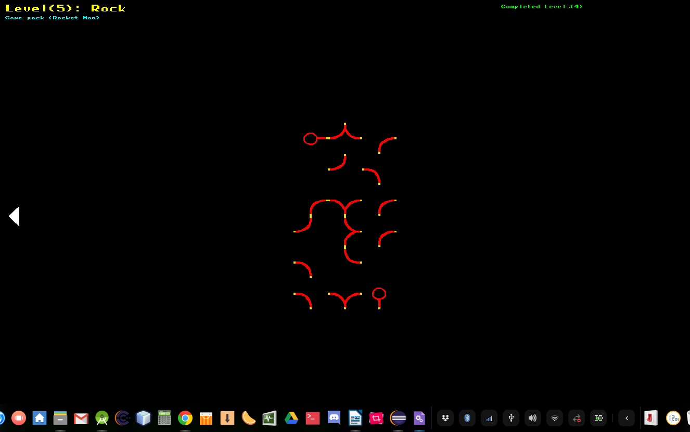

# summerland
Summerland Developments

## Project - Infinity Loop
This application written in C++ is a console game based on the infinity loop game available for mobile app stores. The project is an exporation of the capabilities of C++, to build a cross-platform console game, and explore the game theory and game design in console (in a single threaded application context)

## Design - Extensible Game Paks
The app is designed to be configured and extended via pluggable game definition files.  Meaning the game itself is effectively an engine, taking cues and instructions from the game pak information.

## Previews

Here is a link to the video showing the Game in action (in a linux console - in this example)

